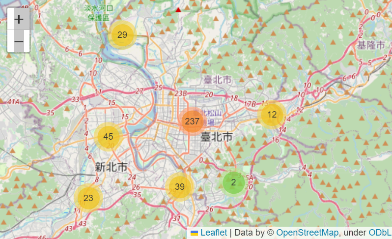
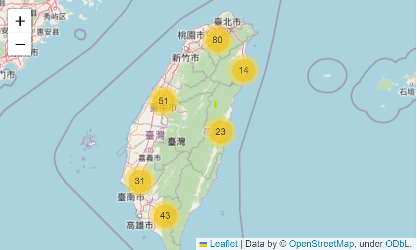
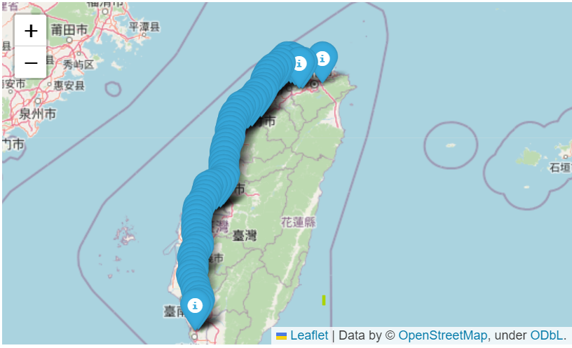

# Project 5 code discription
## MRT_GPS.py
* MRT_GPS.cvs provides lng and lti for each MRT station
* Use MarkerCluster to show the MRT exits on google map

## Train_station.py
* Train_station.cvs provides all the train station in Twiwan
* Use MarkerCluster to show the station on google map
* Mark different colors for train branch

## Highway_km.py
* Highway_km.csv provides all the highway km points
* Mark all the highway km points on google map
* 
